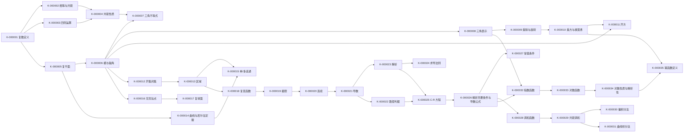

# 学习路径

## 目标与使用方式

- 课程：复变函数与积分变换（李红、谢松法，第 4 版）——**本次仅覆盖 SRC-001 样本范围**：第一章全章、第二章 §2.1–§2.3.3 开头。第三章及以后不在本包内。
- 默认目标（工科本科课程自学 + 期末应试）：能把复数算对、把平面点集判断对、把解析性判断对、把解析函数构造出来、把初等复变函数算对。（如需改为“考研打基础”或“工程应用”，按 [学习需求.md](学习需求.md) 第六节修订。）
- 基础假设：中学复数可能没学过、高等数学（偏导数、全微分、曲线积分）假定已学但未验证，因此关键前置一律在包内讲清。
- 路线分两类：
  - **完整路线**（下面“学习顺序”）覆盖本样本登记的全部知识 ID（K-000001–K-000035）。
  - **主修路线**（时间紧时）：第 1 讲的 §1.1、§1.2 与第 2 讲的 §2.1、§2.2 为必学；§1.3、§1.4、§1.5 与 §2.3 为选学扩展（但 §1.5 的极限与连续是 §2.1 的必要前置，不可跳）。
- 时间范围含阅读、例题与自测，不含章末典型题的额外练习量；实际用时因人而异，不承诺按时掌握。

## 必要前置与补学

| 必要前置 | 用在哪里 | 是否在包内补讲 | 未通过时的补学入口 |
| --- | --- | --- | --- |
| 中学复数初步（$z=x+\mathrm{i}y$、$\mathrm{i}^2=-1$） | 第 1 讲 §1.1 全部 | 是（§1.1 从头讲起，前置自测 P1–P2） | [第 1 讲 §1.1](../学习文档/01-复数与复变函数.md#s1-1) |
| 平面直角坐标与向量加减 | §1.1.3、§1.2.2 | 是（§1.2.2 复习向量法则） | [第 1 讲 §1.2](../学习文档/01-复数与复变函数.md#s1-2) |
| 三角恒等式（两角和、倍角） | §1.2.4、§1.2.5 | 是（例 1.5、例 1.7 逐步展开） | [第 1 讲 §1.2](../学习文档/01-复数与复变函数.md#s1-2) |
| 实函数极限与连续（$\varepsilon$-$\delta$） | §1.5.2 | 是（§1.5.2 用类比说明并给出与实情形的差别） | [第 1 讲 §1.5](../学习文档/01-复数与复变函数.md#s1-5) |
| 偏导数、全微分、二元函数可微 | §2.1.3 定理 2.1 | 是（第 2 讲前置自测 P4–P5 + §2.1.3 逐句解释） | [第 2 讲 §2.1](../学习文档/02-解析函数.md#s2-1) |
| 第二型曲线积分与路径无关 | §2.2.3 曲线积分法 | 是（§2.2 内给出判据与操作步骤） | [第 2 讲 §2.2](../学习文档/02-解析函数.md#s2-2) |

基础未验证，故不设“可跳过的前置”；若你在前置自测中全对，可只做对应节的“深度解析”与自测，跳过“术语与符号”。

## 学习顺序

| 顺序 | 章节及入口 | 必要先修 | 覆盖知识 ID | 可验证目标 | 时间范围 | 过关标准 | 未通过时 |
| --- | --- | --- | --- | --- | --- | --- | --- |
| 1 | [第 1 讲 §1.1 复数](../学习文档/01-复数与复变函数.md#s1-1) | 无 | K-000001–K-000005 | 能对任意复数做四则运算、求共轭、把等式化为实部虚部两组 | 60–90 分钟（含自测 1-1） | 自测 1-1 三题全对且易错辨析表能复述 | 回看 §1.1 例题与自测答案区，重做习题一 1.1–1.3 |
| 2 | [第 1 讲 §1.2 复数的三角表示](../学习文档/01-复数与复变函数.md#s1-2) | 顺序 1 | K-000006–K-000011 | 能求模与主辐角、写三角表示、做乘除乘方开方、判断轨迹 | 120–180 分钟（含自测 1-2） | 自测 1-2 三题全对；开方题能画出正 $n$ 边形验收 | 回看主辐角分段公式与例 1.8；重做习题一 1.6、1.8–1.10 |
| 3 | [第 1 讲 §1.3 平面点集](../学习文档/01-复数与复变函数.md#s1-3) | 顺序 2 | K-000012–K-000015 | 能把不等式化成图形，判断开/闭、有界、单/多连通 | 60–90 分钟（含自测 1-3） | 自测 1-3 三题全对；能说出“区域 = 连通开集” | 回看 §1.3.2 例 1.12 三步法；重做习题一 1.11–1.13 |
| 4 | [第 1 讲 §1.4 无穷大与复球面](../学习文档/01-复数与复变函数.md#s1-4) | 顺序 2 | K-000016–K-000017 | 能说明 $\infty$ 的运算规则与无意义式，能描述测地投影 | 30–45 分钟 | 能默写 5 个无意义式与无穷远点邻域 | 回看 §1.4 两张表 |
| 5 | [第 1 讲 §1.5 复变函数](../学习文档/01-复数与复变函数.md#s1-5) | 顺序 3 | K-000018–K-000020 | 能把 $f(z)$ 拆成 $u+\mathrm{i}v$，判断极限存在性，判断连续性 | 90–120 分钟（含自测 1-4） | 自测 1-4 三题全对；能用两条路径否定极限 | 回看例 1.15、1.16；重做习题一 1.15、1.16 |
| 6 | [第 1 讲 章末自测与典型题](../学习文档/01-复数与复变函数.md#s1-mo) | 顺序 1–5 | 全部 K-000001–K-000020 | 综合运用本章知识解题 | 90–120 分钟 | 章末自测 3 题 + 典型题 4 题达标线见文中 | 按错题对应知识 ID 回到相应节 |
| 7 | [第 2 讲 §2.1 解析函数的概念](../学习文档/02-解析函数.md#s2-1) | 顺序 5（尤其 K-000019、K-000020） | K-000021–K-000027 | 能用定义与 C-R 方程判断可导/解析，写出解析区域与 $f'(z)$ | 150–210 分钟（含自测 2-1） | 自测 2-1 三题全对；能说出 C-R 是必要非充分 | 回看定理 2.1 的证明与反例；重做例 2.4、例 2.5 |
| 8 | [第 2 讲 §2.2 解析函数与调和函数](../学习文档/02-解析函数.md#s2-2) | 顺序 7 | K-000028–K-000031 | 能验证调和性，用偏积分法或曲线积分法构造解析函数 | 120–150 分钟（含自测 2-2） | 自测 2-2 三题全对；两个方法至少各独立做对一题 | 回看例 2.6–2.8；注意积分常数与 $f(z_0)$ 条件 |
| 9 | [第 2 讲 §2.3 初等函数](../学习文档/02-解析函数.md#s2-3) | 顺序 7 | K-000032–K-000035 | 能计算 $e^z$、$\mathrm{Ln}\,z$、$\ln z$，说明周期性、多值性、解析区域 | 90–120 分钟（含自测 2-3） | 自测 2-3 三题全对；能默写三种对数的区别 | 回看例 2.11–2.13 与对数性质反例 |
| 10 | [第 2 讲 章末自测与典型题](../学习文档/02-解析函数.md#s2-mo) | 顺序 7–9 | 全部 K-000021–K-000035 | 综合判断解析性与构造解析函数 | 90–120 分钟 | 章末自测 3 题 + 典型题 4 题达标线见文中 | 按错题对应知识 ID 回到相应节 |

**样本外（待补齐资料后扩展）**：第三章复变函数的积分、第四章解析函数的级数表示、第五章留数及其应用、第六章共形映射、第七章解析函数在平面场的应用、第八章傅里叶变换、第九章拉普拉斯变换，以及附录 1/2 与书末部分习题答案。本包不为这些章节生成链接或模拟题。

## 依赖关系

主修路线（时间紧时必学）：K-000001–K-000011、K-000018–K-000031。
选学路线（有余力扩展）：K-000012–K-000017（拓扑与复球面，为第三章与留数理论做准备）、K-000032–K-000035（初等函数，后续各章每次都要用）。

跨学科联系：K-000009 的“旋转-伸缩”在第六章共形映射与第七章平面场中直接使用；K-000028 的调和函数在平面静电场电位与无源无旋流速场中有直接物理对应（教材 §2.2 开头点明）。类比只在“区域 + 二阶连续偏导”的前提下成立。

## 复习与反馈

| 时点 | 内容 | 具体题目 | 达标标志 |
| --- | --- | --- | --- |
| 当天 | §1.1–§1.2 的公式与主辐角分段 | 自测 1-1、1-2；卡片 [KP-01-02-01](../核心知识点.md#KP-01-02-01) | 主辐角分段公式不查书写出，开方根数与位置判断无误 |
| 第 3 天 | §1.3–§1.5 + §2.1 | 章末自测 1-1、1-2；自测 2-1；卡片 [KP-01-03-01](../核心知识点.md#KP-01-03-01)、[KP-02-01-02](../核心知识点.md#KP-02-01-02) | 区域四判据与 C-R 判据能各自独立说出并各做对一题 |
| 第 7 天 | §2.2–§2.3 | 自测 2-2、2-3；卡片 [KP-02-02-02](../核心知识点.md#KP-02-02-02)、[KP-02-03-02](../核心知识点.md#KP-02-03-02) | 偏积分法与曲线积分法各独立完成一题；三种对数记号不混 |
| 考前 | 全部速查表与易错辨析表 | 两讲章末典型题 T1-1–T1-4、T2-1–T2-4 | 每讲典型题正确率 ≥ 80%，且错题能说出错因与回看位置 |

反馈入口：[学习反馈.md](学习反馈.md)。按症状分流：

- 概念不清（说不清定义与条件）→ 回看对应知识分片 [知识内容.md](知识内容.md) 与卡片“正式定义与公式”块；
- 会背不会用（公式记得但题不会做）→ 回看对应节“深度解析”与“例题答案区”，再重做该节自测的变式题；
- 步骤不稳（思路对但总算错符号/常数）→ 重做“易错辨析”表并逐条写出诊断提示，重点练 §1.2.4、§2.2.3。

## 受限说明

本路径只覆盖 SRC-001 样本所含章节。第二章 §2.3.3 之后的幂函数性质、三角函数与双曲函数、第二章小结与习题均不在资料范围内，故路径中不含相应节点；补齐资料后按 [学习需求.md](学习需求.md) 第六节与 `_工作区/生成进度.json` 的 `next_action` 扩展。
